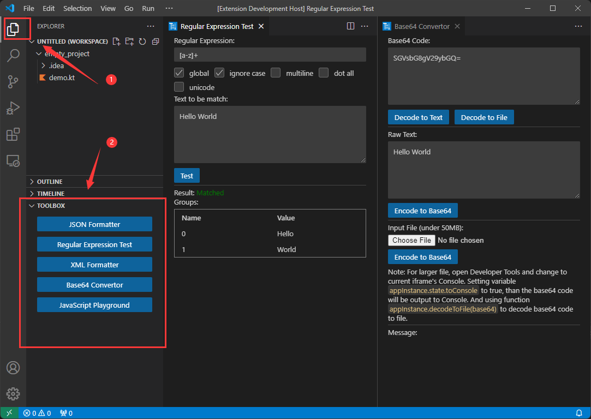

#  Toolbox

This extension provides a set of useful tools for developing.

Get from 
[Marketplace](https://marketplace.visualstudio.com/items?itemName=caiqichang.vscode-toolbox) 
or 
[OpenVSX](https://open-vsx.org/extension/caiqichang/vscode-toolbox)

## Features
- JSON Formatter
- Regular Expression Test
- XML Formatter
- Base64 Convertor
- JavaScript Playground
- Programming languages highlight supports
  - Kotlin
  - Mermaid

## Usage
Open the `Explorer` view and expand the `Toolbox` menu, than choose functions to use.

[Back to top](#features)

